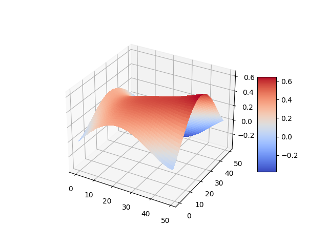

# Perlin noise

## Kaj je to?
Perlin noise je način za generiranje tekstur, ki izgledajo naravno. Uporablja pa se tudi  za avtomatsko generiranje terena pri Minecraftu.

## Viri
- https://en.wikipedia.org/wiki/Perlin_noise
- https://gist.github.com/eevee/26f547457522755cb1fb8739d0ea89a1
- https://matplotlib.org/stable/gallery/mplot3d/surface3d.html

